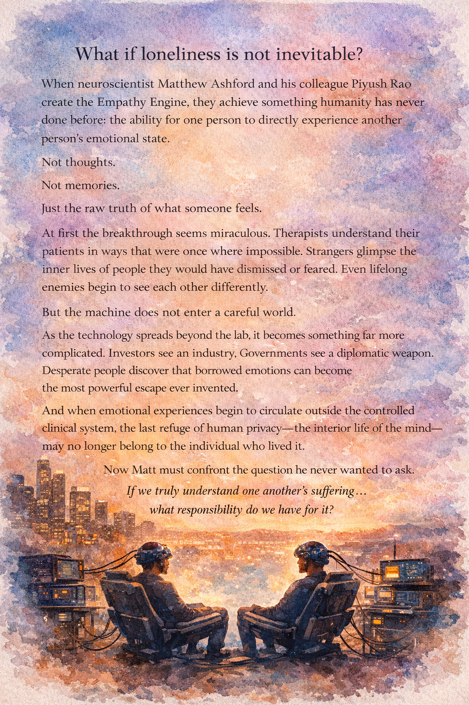

# What It Feels Like to Be You

> A novel by *Joshua Szepietowski*

Fifteen years in the future, neuroscientist Matthew Ashford helps build a machine that lets one person feel another's emotions. As the Empathy Engine escapes the lab and becomes a tool for healing, addiction, and power, he is forced to confront what human connection can and cannot be engineered.

## Build Artifacts

- `./scripts/create_manuscript.sh` assembles `MANUSCRIPT.md` from the chapter files.
- `./scripts/create_pdf.sh` renders `MANUSCRIPT.pdf` from `MANUSCRIPT.md` using `pandoc` and `pdflatex`, with `cover.png` as the opening page.
- `./scripts/create_artifacts.sh` runs both steps in order.

The PDF build requires `pandoc` and a LaTeX installation that provides `pdflatex`.
